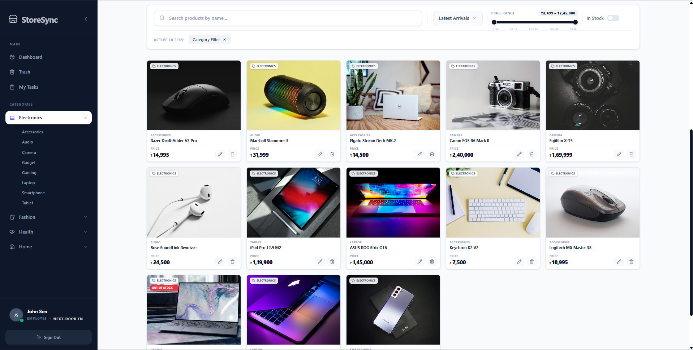
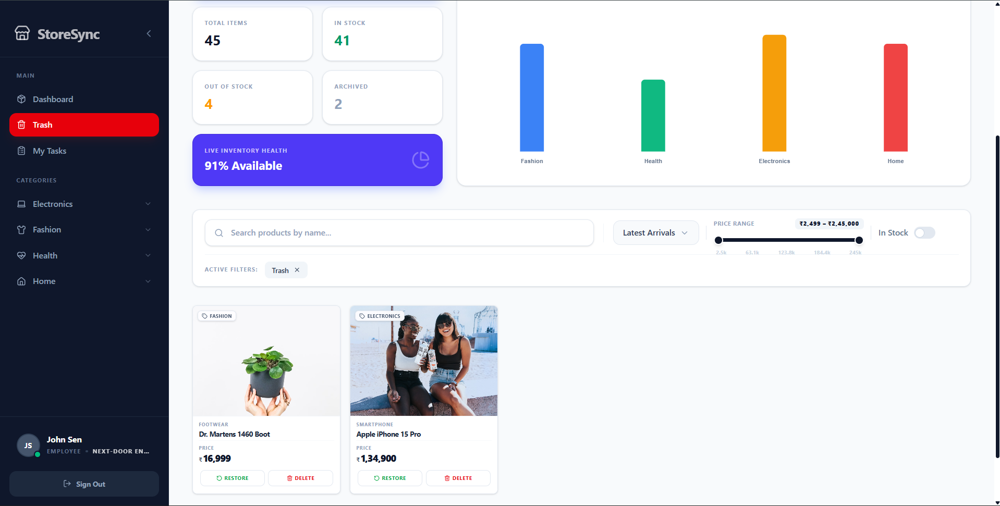

<div align="center">

  <h1>StoreSync</h1>
  <h3>Multi-Tenant Inventory Management System</h3>
  
  <p>A full-stack SaaS application built on the MERN stack. It handles global inventory management, role-based access control, real-time task delegation, and detailed data visualization for multiple independent shops.</p>

  <p>
    
    
    
    
    
    
    
  </p>
</div>

---

## User Interface

<p align="center">
  
  
  
</p>
<p align="center">
  
  
  
</p>
<p align="center">
  
  
  
</p>
<p align="center">
  
  
  
</p>
<p align="center">
  
  
  
</p>

---

## Table of Contents
- [Overview](#overview)
- [Detailed Platform Workflow & Features](#detailed-platform-workflow--features)
- [System Architecture](#system-architecture)
- [Tech Stack](#tech-stack)
- [Getting Started](#getting-started)
- [Environment Variables](#environment-variables)
- [API Overview](#api-overview)
- [Future Roadmap](#future-roadmap)
- [Author](#author)

---

## Overview

StoreSync is a comprehensive multi-tenant SaaS application. It is designed to allow multiple independent businesses (tenants) to manage their daily shop operations, inventory, and employees within a single unified platform. Every shop operates in complete isolation, ensuring data privacy, while a centralized super administrator retains the ability to monitor the overall health and analytics of the entire platform.

Because this project is currently not deployed, this documentation serves as a complete breakdown of the engineering decisions, feature implementations, and the overall system architecture.

---

## Detailed Platform Workflow & Features

The platform handles everything from the moment a user registers a shop, to managing their staff, tracking their stock, and analyzing their business growth. Here is a detailed look at how each system operates under the hood:

### 1. Authentication & Security Workflow
- **Registration and Identity Verification**: When a new user registers to create a shop, their account is initially unverified. The backend automatically generates a secure One-Time Password (OTP) and sends it directly to their email using Nodemailer. The user must submit this OTP to verify their identity and unlock platform access.
- **Dual-Token Login System**: To maximize security, the authentication system uses a dual-token approach. When a user logs in, the server issues a short-lived JSON Web Token (Access Token) which the frontend stores in memory. Simultaneously, a Refresh Token is issued and stored in an `HTTPOnly`, `SameSite=Strict` cookie. This prevents malicious scripts from accessing the refresh token, effectively eliminating Cross-Site Scripting (XSS) vulnerabilities.
- **Account Recovery Flow**: If a user forgets their password, they can trigger a password reset flow. The system emails them a secure OTP. Once verified, the user is granted permission to set a new password, ensuring that account recovery is both seamless and secure.
- **Backend API Protection**: Security is handled at the network layer. The application uses `helmet` to set secure HTTP headers, `express-rate-limit` to throttle repeated requests and prevent brute-force login attacks, and Mongoose's strict schemas to naturally sanitize inputs and prevent NoSQL injection.

### 2. Multi-Tenant Shop Management
- **Data Isolation**: The database is structured around the `Shop` model. When a user creates a shop, they become the Shop Owner. Any product, category, task, or employee created moving forward is strictly tied to that specific Shop ID. This ensures that no tenant can ever accidentally access or query data belonging to another business.
- **Super Administrator Controls**: A global Super Admin can be seeded into the database directly via a backend script. This admin has a unique dashboard that allows them to view all registered shops across the platform. They have the authority to manually approve pending shops, restrict access if needed, and view high-level platform statistics.
- **Role-Based Access Control (RBAC)**: The application strictly enforces permissions based on the user's role. Shop Owners have full control over their tenant settings and analytics. Managers are permitted to handle daily inventory tasks and assign work to staff. Employees have restricted access, primarily logging in to view and complete the tasks assigned specifically to them.

### 3. Employee Management & Automated Communication
- **Streamlined Onboarding**: Shop Owners and Managers can add new employees to their system through the dashboard. Instead of requiring the employee to set up their own account initially, the backend automatically generates a secure temporary password and a unique Employee ID.
- **Welcome Emails**: The exact moment the employee profile is created, the server compiles an HTML email template and sends a Welcome Email to the new staff member. This email contains their new Employee ID, their registered email address, and their temporary password, providing them immediate access to log in.
- **Forced Password Resets**: If an employee gets locked out of their account, a Manager or Shop Owner can trigger a manual password reset from their dashboard. The system generates a fresh secure password on the spot and emails a Password Reset Notification directly to the employee.

### 4. Inventory, Assets, and Bulk Data Processing
- **Dynamic Taxonomy**: Shop owners can structure their inventory exactly how they want by creating custom categories and nested subcategories.
- **Cloudinary Asset Management & Garbage Collection**: When a user uploads a product image, it is sent to Cloudinary for cloud hosting. To prevent the cloud storage from filling up with unused files over time, the backend implements a garbage collection system. If a user deletes a product, or replaces an old product image with a new one, the server sends an asynchronous background request to Cloudinary to permanently delete the old image file.
- **Soft Deletion Strategy**: To maintain accurate historical data and analytics, products are never hard-deleted from the database. Instead, the system uses a "Soft Delete" approach. Deleting a product simply flags it as inactive and moves it to a hidden state, ensuring that past sales or task records tied to that product don't break.
- **CSV Stream Processing**: For businesses migrating large inventories, manually entering products is inefficient. The system allows Shop Owners to upload large CSV files containing their inventory. The backend handles this using Node.js streams (`csv-parser`), which processes the file row by row asynchronously. This ensures that uploading thousands of products won't block the main event loop or crash the server.

### 5. Real-Time Task Delegation
- **Task Assignment**: Managers can delegate specific inventory duties (like restocking an aisle or auditing stock) to individual employees, complete with due dates and priority levels.
- **Immediate Email Notifications**: As soon as a manager assigns a task, the backend fires off a Task Assignment Email to the employee. This email outlines the task title, the deadline, and the name of the manager who assigned it, ensuring the employee is notified even if they aren't logged in.
- **WebSocket Integration**: The task management dashboard is fully integrated with `socket.io`. If a manager is viewing the dashboard and an employee updates a task status from "Pending" to "In Progress", the change reflects instantly on the manager's screen without requiring a page refresh.

### 6. Complex Data Aggregation & Analytics
- **Super Admin Analytics**: The Super Admin dashboard relies on complex MongoDB aggregation pipelines to calculate platform-wide metrics. It visualizes user growth trends over time, counts active versus restricted shops, and calculates the total combined stock valuation across the entire SaaS platform.
- **Shop Owner Analytics**: Shop owners get access to localized analytics. Their dashboard charts out their specific category distributions, tracks daily employee logins, and highlights low-stock items that need immediate attention.

---

## System Architecture

Here is a deeper look at the engineering decisions behind the data models and frontend structure.

### Database Schema Design
- **`User`**: The central identity model. It handles all authentication details, role definitions, bcrypt hashed passwords, and tracks whether the user has completed their OTP verification.
- **`Shop`**: The core entity that drives the multi-tenant architecture. Every piece of operational data references a specific Shop ID to maintain strict data boundaries.
- **`Product`**: Built to handle massive inventories. It stores pricing, stock levels, Cloudinary image URLs, category references, and the soft-delete flags.
- **`Task`**: Connects managers to employees. It stores the task details, the current completion status, and timestamps to track when work is finished.
- **`AuditLog`**: An internal tracking model. It automatically records sensitive actions—like a user changing a critical setting or an admin deleting a record—to ensure there is a clear historical trail of who did what.

### Frontend Architecture
- **Global State Management**: To avoid the performance bottlenecks associated with React Context re-renders, the application uses **Zustand**. It provides atomic, highly optimized global state slices that manage user sessions and UI toggles efficiently.
- **Network Interceptors**: All HTTP requests route through a centralized Axios singleton. This setup includes automated interceptors that listen for 401 Unauthorized errors. If an access token expires, the interceptor silently catches the error, sends the HTTPOnly refresh cookie to the backend to get a new token, and retries the original request without interrupting the user's experience.
- **Form Handling & UI**: Forms are built using `react-hook-form` to manage complex inputs without triggering unnecessary component re-renders. The UI styling is heavily customized using Tailwind CSS, and utilizes utility libraries like `clsx` and `tailwind-merge` to dynamically compose component classes.

---

## Tech Stack

### Frontend
- **Framework**: React 19.2, Vite 7.2
- **Routing**: React Router v7
- **State Management**: Zustand
- **Styling**: Tailwind CSS v4.1, clsx, tailwind-merge
- **Data Visualization**: Chart.js, Recharts, react-chartjs-2
- **Forms**: React Hook Form
- **HTTP Client**: Axios

### Backend
- **Runtime**: Node.js (v18+)
- **Framework**: Express.js (v5.1 native Promises)
- **Database**: MongoDB, Mongoose (v8.19)
- **Authentication**: JWT, bcryptjs
- **Real-Time**: Socket.io
- **File Uploads**: Multer, Cloudinary
- **Utilities**: CSV-Parser (bulk imports), Nodemailer (SMTP), Winston & Morgan (Logging)
- **Security**: Helmet, express-rate-limit, cors

---

## Getting Started

### Prerequisites
- Node.js `v18.x` or higher
- MongoDB server (Local instance or Atlas cluster)
- SMTP Provider for system emails (e.g., Gmail App Password)
- Cloudinary Account for image hosting

### 1. Clone the Repository
```bash
git clone https://github.com/SubhradeepNathGit/StoreSync.git
cd StoreSync
```

### 2. Backend Setup
Navigate to the server directory and install dependencies:
```bash
cd server
npm install
```

### 3. Frontend Setup
Open a new terminal window in the project root and setup the client:
```bash
cd client
npm install
```

---

## Environment Variables

### Server (`/server/.env`)
Create a `.env` file in the `/server` directory and configure the following variables:

```env
# Server Configuration
PORT=3006
CLIENT_URL=http://localhost:5173

# Database Connection
MONGO_URI=mongodb+srv://<user>:<password>@cluster.mongodb.net/storesync

# Authentication Secrets
JWT_SECRET=your_jwt_secret_key
JWT_REFRESH_SECRET=your_jwt_refresh_secret_key

# SMTP Server Configurations (For OTP and System Emails)
EMAIL_USER=your_verified_service_email@gmail.com
EMAIL_PASS=your_gmail_app_password

# Cloudinary Setup (For Image Asset Management)
CLOUDINARY_CLOUD_NAME=your_cloud_name
CLOUDINARY_API_KEY=your_api_key
CLOUDINARY_API_SECRET=your_secret

# Super Admin Credentials
SUPER_ADMIN_EMAIL=your_admin_email@example.com
SUPER_ADMIN_PASSWORD=your_secure_password
```

### Applying Super Admin Credentials
To apply or update the Super Admin credentials in the database, ensure your `.env` file has the `SUPER_ADMIN_EMAIL` and `SUPER_ADMIN_PASSWORD` variables correctly set, then run the seeding script:

```bash
cd server
node seed-super-admin.js
```

### Running the Application
Start both the client and server concurrently (requires two terminal windows).

**Terminal 1 (Backend):**
```bash
cd server
npm run dev
```

**Terminal 2 (Frontend):**
```bash
cd client
npm run dev
```

---

## API Overview

The backend provides a structured RESTful API. Below is a high-level overview of the primary route modules:

- **`/api/auth`**: Handles user registration, secure login, logout functionality, token refreshing, OTP email verification, and password resets.
- **`/api/admin`**: Protected routes strictly for the Super Admin to fetch platform-wide analytics and manage shop approvals.
- **`/api/shop`**: Manages shop creation, retrieving shop details, and updating tenant-specific configurations.
- **`/api/product`**: Covers all CRUD operations for the inventory, soft deletion toggles, handling Cloudinary image uploads, and processing bulk CSV streams.
- **`/api/category` & `/api/subcategory`**: Manages the dynamic taxonomy and folder structure for a shop's inventory.
- **`/api/task`**: Handles real-time task creation, assigning duties to employees, and emitting WebSocket events on status changes.
- **`/api/employee`**: Manages the creation of staff members, retrieving employee lists, and handling forced password resets.

---

## Future Roadmap

- [ ] **TypeScript Migration**: Updating the codebase to TypeScript to enforce strict type safety and improve maintainability.
- [ ] **Caching Layer**: Integrating Redis to cache heavy database queries and analytical aggregations to improve load times.
- [ ] **Testing Suite**: Building out comprehensive unit and integration tests using Jest and Cypress.
- [ ] **Containerization**: Implementing Docker to standardize the deployment process and prepare the application for scalable cloud hosting.

---

## Author

**Subhradeep Nath**  
*Full Stack Software Engineer*

- **GitHub:** [SubhradeepNathGit](https://github.com/SubhradeepNathGit)
- **LinkedIn:** [Subhradeep Nath](https://www.linkedin.com/in/subhradeep-nath/)
