<div align="center">

  <h1>📦 StoreSync</h1>
  <h3>Enterprise Multi-Tenant Inventory Ecosystem</h3>
  
  <p>A production-grade, highly-secured SaaS boilerplate built on the bleeding-edge MERN stack for global inventory management, complex RBAC, real-time task delegation, and advanced data visualization.</p>

  <p>
    
    
    
    
    
    
    
  </p>
</div>

---

## 🎨 Production UI Grid

<p align="center">
  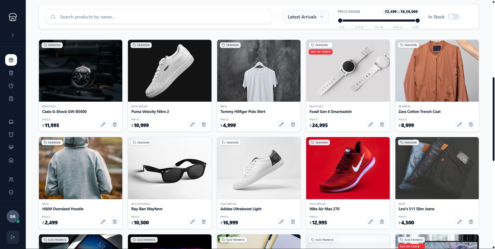
  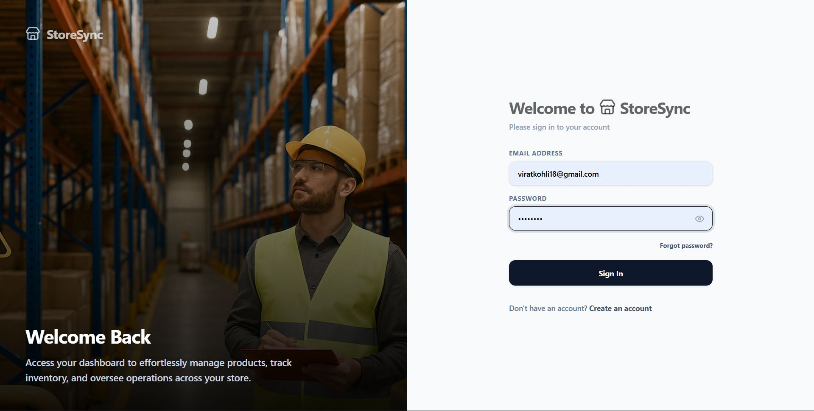
  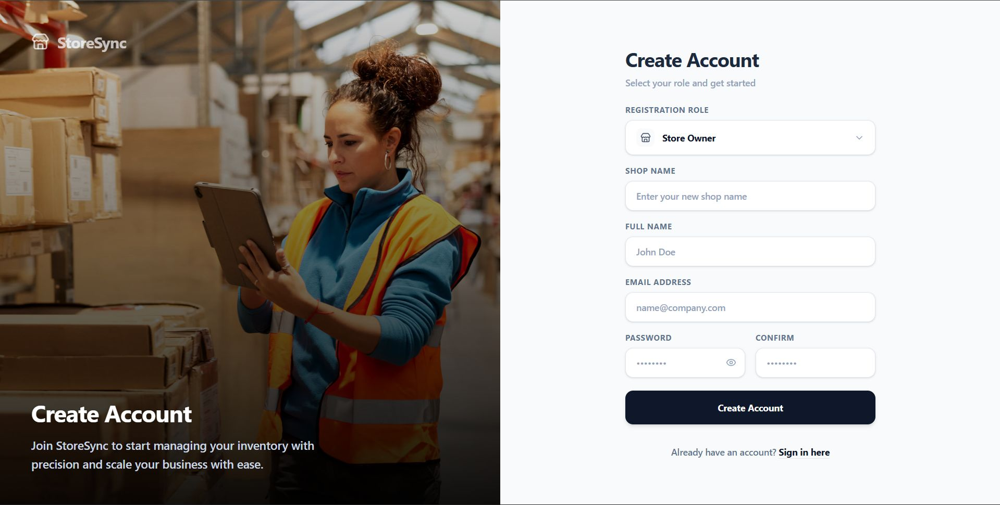
</p>
<p align="center">
  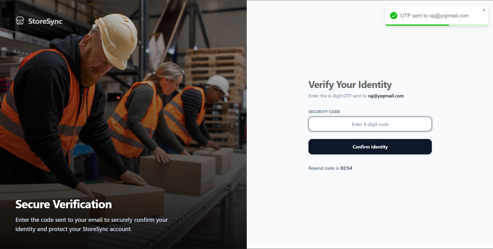
  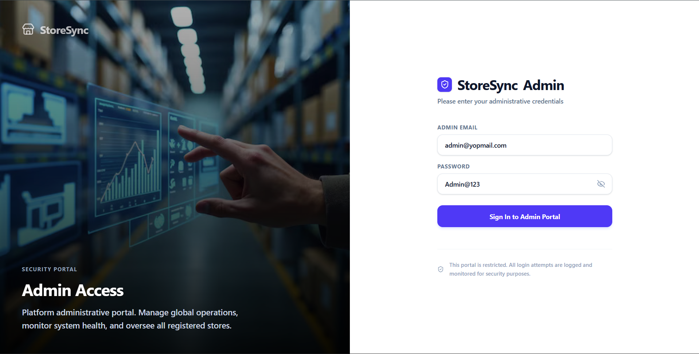
  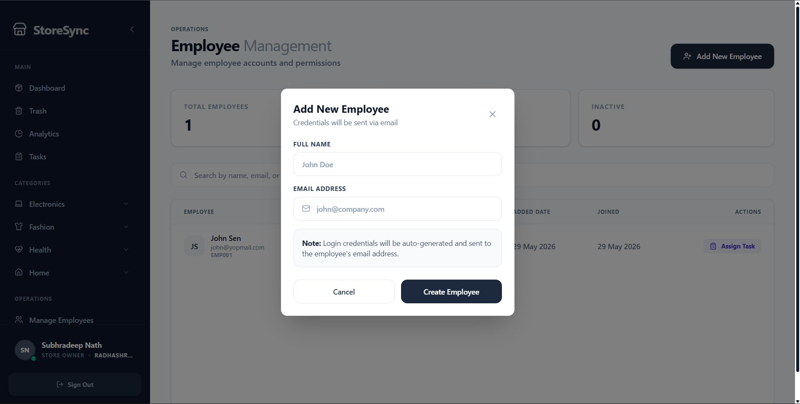
</p>
<p align="center">
  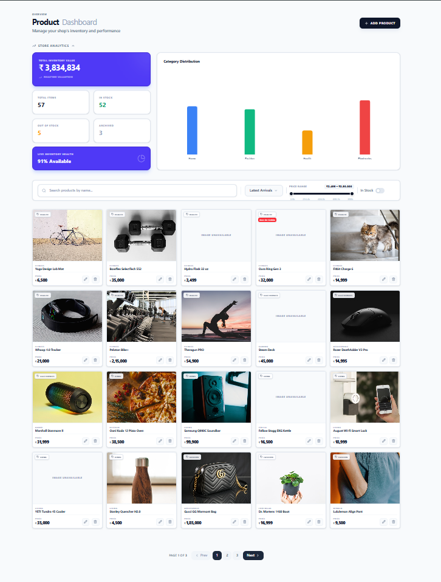
  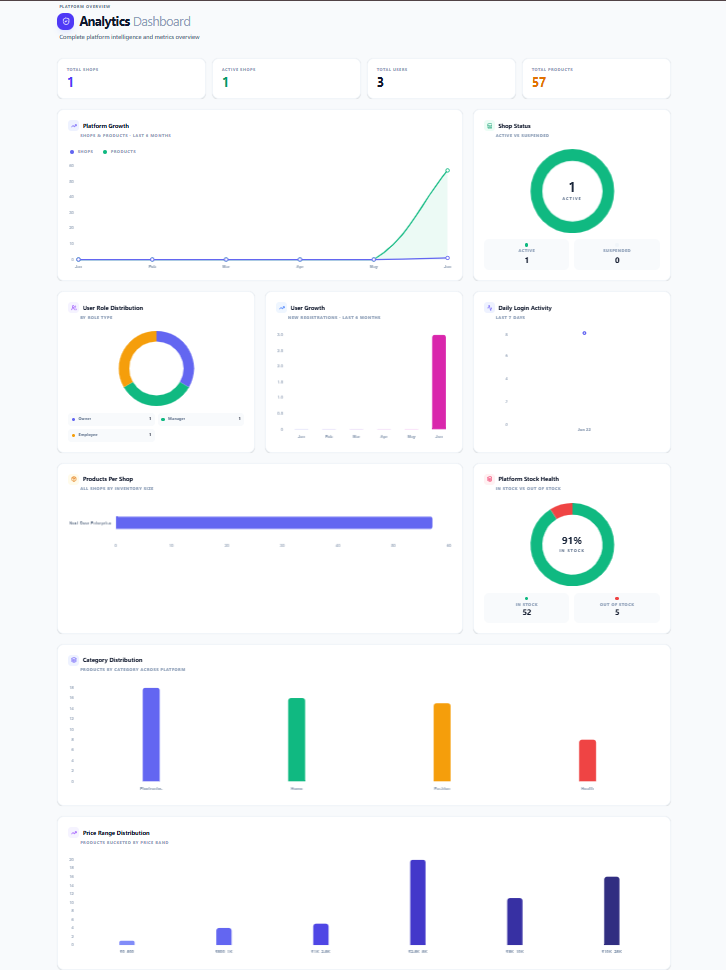
  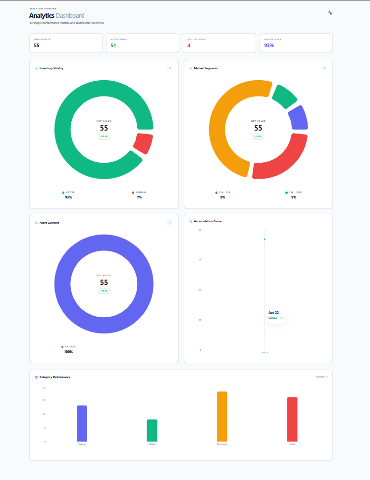
</p>
<p align="center">
  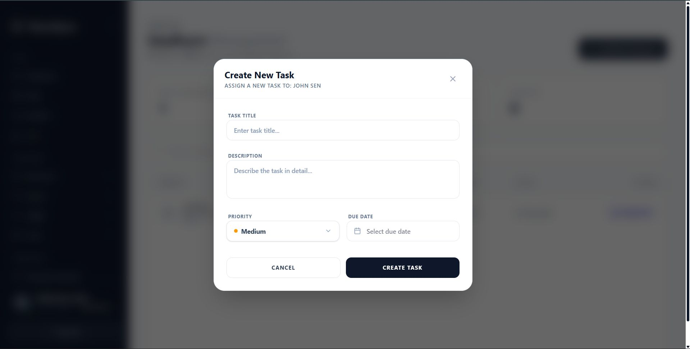
  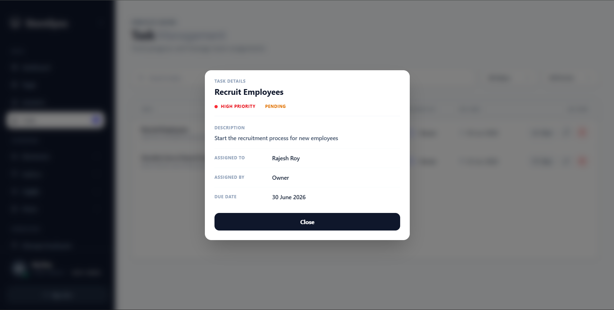
  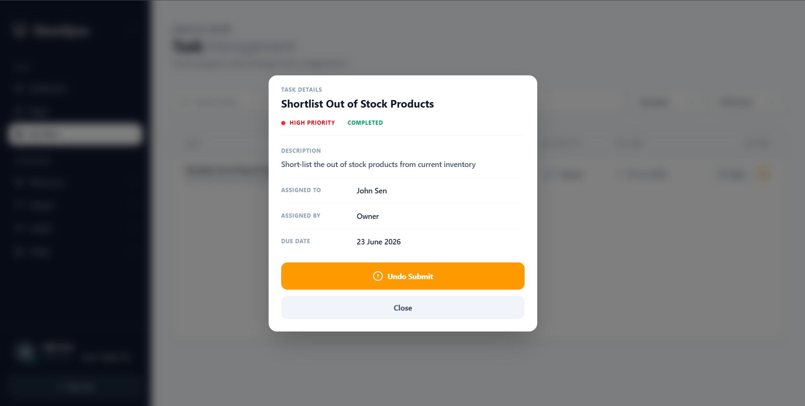
</p>
<p align="center">
  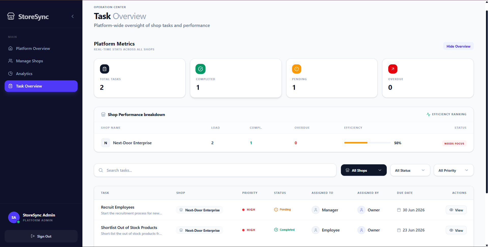
  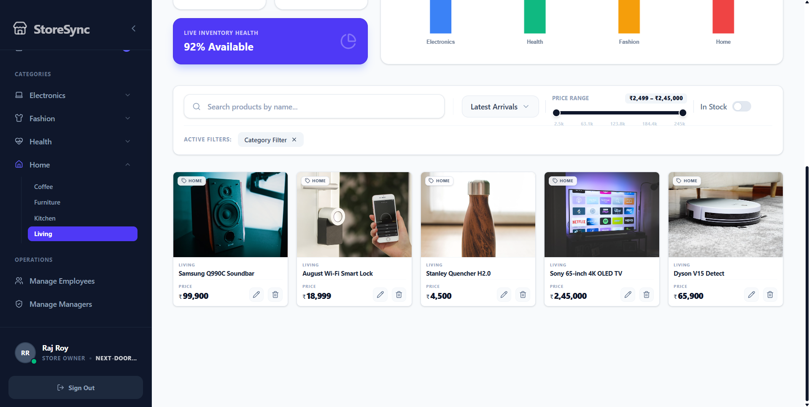
</p>

---

## 📑 Table of Contents
- [Executive Summary](#-executive-summary)
- [Complete Platform Workflow & Features](#-complete-platform-workflow--features)
- [System Architecture](#-system-architecture)
- [Tech Stack](#-tech-stack)
- [Project Screenshots](#-project-screenshots)
- [Getting Started](#-getting-started)
- [Environment Variables](#-environment-variables)
- [API Overview](#-api-overview)
- [Future Roadmaps](#-future-roadmaps)
- [Author](#-author)

---

## 📖 Executive Summary

**StoreSync** is not a standard CRUD application; it is a meticulously architected **Multi-Tenant SaaS solution** built to demonstrate enterprise-level full-stack engineering. It handles isolated shop ecosystems (tenants) under a centralized platform overseen by Super Admins. 

This repository was purposefully designed to showcase advanced capabilities in **Backend Architecture**, **Frontend State Management**, and **System Security**. It implements industry-standard practices suitable for large-scale production deployments.

---

## 🚀 Complete Platform Workflow & Features

StoreSync encompasses an end-to-end SaaS lifecycle for inventory and team management. Here is a granular breakdown of every operational feature and the intelligent workflows driving them:

### 1. Advanced Authentication & Security Workflows
- **Registration & Verification**: Users register as Shop Owners. The system immediately sends a **One-Time Password (OTP) via Email** to verify their identity before they can access the platform.
- **Secure Login**: Employs Dual-Token Architecture. A short-lived Access Token is kept in memory, while a Refresh Token is stored securely in an `HTTPOnly`, `SameSite=Strict` cookie, entirely immune to XSS attacks.
- **Password Recovery**: Users who forget their passwords can request a reset. The system sends a **Password Reset OTP via Email**. Upon verifying the OTP, the user can securely set a new password.
- **API Hardening**: All routes are protected by `helmet` headers, and brute-force attacks are mitigated using `express-rate-limit`. NoSQL injection attempts are inherently sanitized through Mongoose strict schemas.

### 2. Multi-Tenant Shop Operations
- **Shop Initialization**: Verified users can register their Shop details (tenant), fully isolated from other ecosystems.
- **Super Admin Oversight**: A centralized Super Admin (seeded via script) monitors the entire SaaS platform. The Super Admin has the authority to view all shops, approve or restrict them, and monitor global analytical metrics.
- **Comprehensive RBAC**: Role-Based Access Control powers the entire platform:
  - *Super Admin*: Platform oversight.
  - *Shop Owner*: Tenant administration, employee management, shop-specific analytics.
  - *Manager*: Inventory management, task delegation.
  - *Employee*: Task execution and limited inventory access.

### 3. Comprehensive Employee Management & Automated Communications
- **Employee Onboarding**: Shop Owners and Managers can add Employees to their team. During creation, the system auto-generates a secure password and employee ID.
- **Welcome Emails**: Upon creation, the system triggers a **Welcome Email** sent directly to the new employee containing their Employee ID, login email, and the auto-generated temporary password, prompting them to log in and change it.
- **Password Administration**: If an employee loses access, Managers/Owners can force a password reset. This automatically generates a new secure credential and sends a **Password Reset Notification Email** directly to the employee containing the new temporary password.

### 4. Dynamic Inventory & Product Ecosystem
- **Taxonomy Structure**: Shop Owners can dynamically build their taxonomy by creating Categories and nested Subcategories for intricate product sorting.
- **Product Operations**: Full CRUD (Create, Read, Update, Delete) capabilities for vast enterprise inventories.
- **Smart Asset Management**: Images uploaded to products are hosted on **Cloudinary**. When a product is updated with new images or deleted, an asynchronous background event fires to Cloudinary to perform **Garbage Collection**, deleting the old assets to prevent storage bloat.
- **Soft Deletion**: Products are never hard-deleted immediately. They utilize a "Soft Delete" flag, moving them to a trash bin to retain referential integrity in past analytical data.
- **Mass CSV Importing**: Instead of manual entry, Shop Owners can bulk-upload inventory via CSV files. The backend utilizes **Node.js Streams (`csv-parser`)** to process thousands of rows asynchronously without blocking the main event loop.

### 5. Real-Time Task Delegation
- **Assignment Workflow**: Managers can create and assign specific inventory tasks to Employees with designated due dates and priority levels.
- **Instant Email Notifications**: The exact moment a task is assigned, the backend compiles a formatted HTML template and sends a **Task Assignment Email** to the employee, detailing the Task Title, Due Date, and the Assigning Manager.
- **Live WebSocket Updates**: Utilizing `socket.io`, the task dashboard updates in real-time across all browser sessions. When an employee marks a task as 'In Progress' or 'Completed', the Manager's dashboard reflects the change instantly without requiring a page refresh.

### 6. Heavy Data Aggregation & Analytics
- **Super Admin Dashboard**: Visualizes platform-wide growth, including User Growth Trajectories, Total Active Shops, and Platform Stock Valuations using dense MongoDB Aggregation pipelines.
- **Shop Owner Dashboard**: Provides localized analytics such as Category Distributions, Daily Logins, and inventory depletion alerts mapped beautifully via frontend charting software.

---

## 🏗️ System Architecture

To fully understand the scale of this project, here is a detailed breakdown of the exact engineering standards implemented:

### Database Schema & Data Modeling
- **`User`**: Centralized identity model. Manages roles, hashed passwords (bcrypt), and account verification states (OTP).
- **`Shop`**: The core multi-tenant entity. Each user/product/task belongs to a specific Shop, ensuring logical data isolation.
- **`Product`**: Handles massive enterprise inventory. Incorporates smart "Soft Delete" logic.
- **`Task`**: Powers the real-time project management aspect. Tracks task assignment between managers and employees. 
- **`AuditLog`**: Security compliance tracker. Automatically records sensitive data modifications and user actions historically.

### Client-Side Engineering
- **State Orchestration**: Bypassed React Context rendering bottlenecks by utilizing **Zustand** for atomic, lightning-fast global state slices.
- **Network Pipeline**: A sophisticated singleton Axios instance featuring automated request/response interceptors. Seamlessly catches 401 errors and attempts silent token refreshes.
- **Dynamic UI**: Composed strictly typed components enhanced via `clsx` and `tailwind-merge`. Implemented `react-hook-form` for uncontrolled, re-render-free user inputs.

---

## 💻 Tech Stack

### Frontend
- **Framework**: React 19.2, Vite 7.2
- **Routing**: React Router v7
- **State Management**: Zustand
- **Styling**: Tailwind CSS v4.1, clsx, tailwind-merge
- **Data Visualization**: Chart.js, Recharts, react-chartjs-2
- **Forms**: React Hook Form
- **HTTP Client**: Axios

### Backend
- **Runtime**: Node.js (v18+)
- **Framework**: Express.js (v5.1 native Promises)
- **Database**: MongoDB, Mongoose (v8.19)
- **Authentication**: JWT, bcryptjs
- **Real-Time**: Socket.io
- **File Uploads**: Multer, Cloudinary
- **Utilities**: CSV-Parser (bulk imports), Nodemailer (SMTP), Winston & Morgan (Logging)
- **Security**: Helmet, express-rate-limit, cors

---

## 📸 Project Screenshots

<p align="center">
  
</p>
<p align="center">
  
</p>
<p align="center">
  
  
</p>

*(Screenshots reside in `/client/public/`)*

---

## ⚙️ Getting Started

### Prerequisites
- Node.js `v18.x` or higher
- MongoDB server (Local instance or Atlas Cluster)
- Valid SMTP Provider (e.g., Gmail App Password) for system emails
- Cloudinary Account (for image management)

### 1. Clone the Repository
```bash
git clone https://github.com/SubhradeepNathGit/StoreSync.git
cd StoreSync
```

### 2. Backend Setup
```bash
cd server
npm install
```

### 3. Frontend Setup
Open a new terminal in the project root:
```bash
cd client
npm install
```

---

## 🔐 Environment Variables

### Server (`/server/.env`)
Create a `.env` file in the `/server` directory:

```env
# Server Configuration
PORT=3006
CLIENT_URL=http://localhost:5173

# Database
MONGO_URI=mongodb+srv://<user>:<password>@cluster.mongodb.net/storesync

# Authentication Secrets
JWT_SECRET=your_ultra_secure_64byte_secret
JWT_REFRESH_SECRET=your_isolated_refresh_secret

# SMTP Server Configurations (OTP routing)
EMAIL_USER=your_verified_service_email@gmail.com
EMAIL_PASS=your_gmail_app_password

# Cloudinary Setup (Asset Management)
CLOUDINARY_CLOUD_NAME=your_cloud_name
CLOUDINARY_API_KEY=your_api_key
CLOUDINARY_API_SECRET=your_secret

# Super Admin Credentials
SUPER_ADMIN_EMAIL=your_admin_email@example.com
SUPER_ADMIN_PASSWORD=your_secure_password
```

### Applying Super Admin Credentials
To apply or update the Super Admin credentials in the database, ensure your `.env` file has the `SUPER_ADMIN_EMAIL` and `SUPER_ADMIN_PASSWORD` variables set, then run the seeding script:

```bash
cd server
node seed-super-admin.js
```

### Running the Application
Start both the client and server concurrently (requires two terminal windows).

**Terminal 1 (Backend):**
```bash
cd server
npm run dev
```

**Terminal 2 (Frontend):**
```bash
cd client
npm run dev
```

---

## 🌐 API Overview

The backend exposes a highly structured RESTful API. Below is a high-level overview of the main route modules:

- **`/api/auth`**: Registration, Login, Logout, Token Refresh, OTP verification, Password Reset.
- **`/api/admin`**: SuperAdmin-only routes for platform analytics, shop approvals, and global user management.
- **`/api/shop`**: Shop creation, shop settings, and tenant-specific configurations.
- **`/api/product`**: CRUD operations, soft deletes, image uploads (Cloudinary), and bulk CSV streaming.
- **`/api/category` & `/api/subcategory`**: Taxonomy management for shop inventories.
- **`/api/task`**: Real-time task delegation with WebSocket event emitting.
- **`/api/employee`**: Shop-specific employee management and role assignments.

---

## 📈 Future Roadmaps

- [ ] **TypeScript Migration**: Transitioning strictly towards Typescript architectures to fortify endpoint data-contracting.
- [ ] **Caching Layer**: Integrating Redis logic layers to cache exhaustive analytical DB queries globally.
- [ ] **Testing Suite**: Developing comprehensive Test-Driven parameters using Jest & Cypress.
- [ ] **Containerization**: Implementing Docker to standardize platform deployment methodologies utilizing Kubernetes auto-scaling infrastructures.

---

## 👨‍💻 Author

<p align="center">
  <b>Designed, engineered, and scaled by Subhradeep Nath.</b><br>
  <i>If you are a Recruiter, Engineering Manager, or Developer assessing my architectural standards, please feel free to explore the codebase and drop a ⭐ if you found the engineering insightful!</i>
</p>
